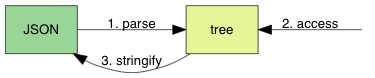

## 一. 简介

TinyJson这个项目的思路源自于RapidJson，虽然仅仅支持utf-8字符集的json字符串解析和字符串生成，但更轻量简洁，目前它有着如下的特性：

- 支持DOM（Document Object Model，文档对象模型）风格的API接口；
- 使用C++17中的variant替代联合union实现JsonValue类，方便且安全，不需要手动new/delete；
- 使用递归下降分析法实现json字符串解析，核心思想非常容易学习


## 二. 使用

一个json库的工作无非就是三个：①将json字符串解析成json树这样的数据结构；②提供给用户访问json解析树的功能，方便用户的查找、添加、修改、删除解析树中某一个字段或值；③将json解析树序列化，生成json字符串。如下所示：



在TinyJson中，主要有如下几个概念：

1. **Json字符串输入输出流Stream**：它的任务就是提供给json解析器输入json字符串和提供给json生成器输出json字符串的能力。具体包括内存输入流`StringReadStream`、文件输入流`FileReadStream`、内存输出流`StringWriteStream`和文件输出流`FileWriteStream`；
2. **Json解析器JsonReader**：它的任务就是从上述的输入流中解析json字符串，并调用Json处理器（一般是Json文档类Document，即一般意义上的Json解析树）中的处理函数（，这样我们就可以让Json文档记录Json字符串中的各个字段和值）；
3. **Json值JsonValue和Json解析树Document**：其中JsonValue用来记录json字符串中具体的值（它可能是json解析树中的树根，也可能是树中的中间节点，也可能是树中的叶子节点），而Json解析树（即文档类Document）则是用来描述json字符串解析之后得到的整个树，同时它还向用户提供了访问、添加、修改、删除其中字段/元素/值的接口；
4. **Json序列化器JsonWriter**：它的任务与json解析器的任务正好相反，一般它是用来将json解析树（可能是用户自己创建的、也可能是从另一个json字符串解析得到并被用户修改的、等等）序列化成一个json字符串。

其中Json解析树Document和JsonWriter都属于Handler中的概念，因为它们可以提供给另一方触发信息记录（这个记录可以是将字段信息写入到Document或写入到某一个指定输出流）的能力，它也正表明信息的流向（如上图所示的`1. parse`和`3. stringify`），从而实现json的反序列化和序列化功能。从代码上将讲，它们的类体系结构如下所示：


以一个json字符串解析+添加字段+字符串化来展示TinyJson的使用：

```cpp
int main() {
  Document document;

  // 1、解析json字符串
  StringReadStream is(jsonSampleStr3);
  document.parseStream(is);

  // 2、向json解析树中添加新的成员，这里是一个数组
  document.addMember("children", JsonValue(JsonValue::TYPE_ARRAY));
  auto &arr = document["children"];
  arr.addValue("Little Joe");
  arr.addValue("Lovely Tina");

  // 3、序列化输出json解析树
  FileWriteStream os(stdout);
  JsonPrettyWriter<FileWriteStream> writer(os);
  document.stringify(writer);

  return 0;
}
```

> 从上面的接口使用中也可以看出当前的TinyJson还并不是非常好用，一些常用的接口其实还没有，有很多点需要进一步的完善！


## 三. 编译安装

```bash
$> git clone https://github.com/Ye-zixiao/TinyJson.git
$> sh ./build.sh
```


## 四. 参考资料

1. [json-tutorial](https://github.com/miloyip/json-tutorial.git)
2. [RapidJson](https://gitee.com/Tencent/RapidJSON.git)

